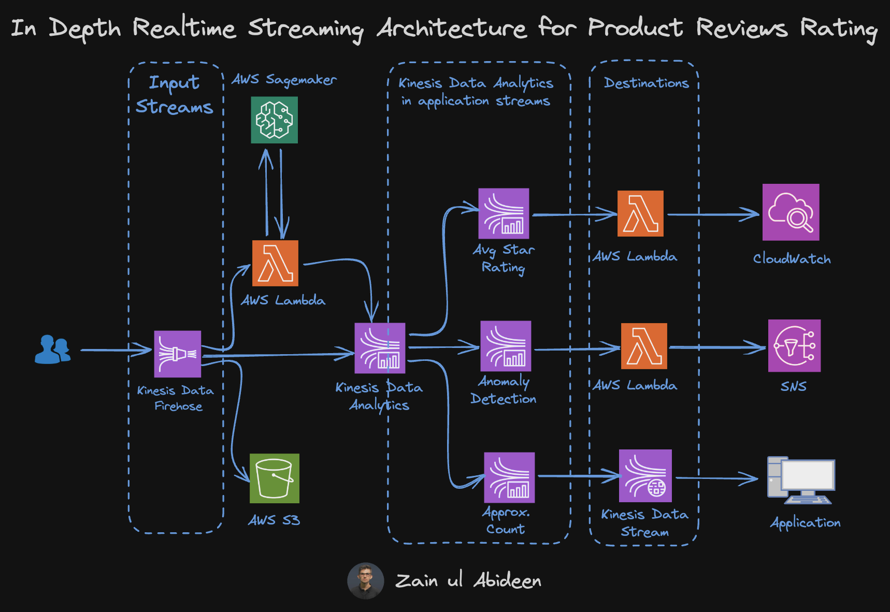
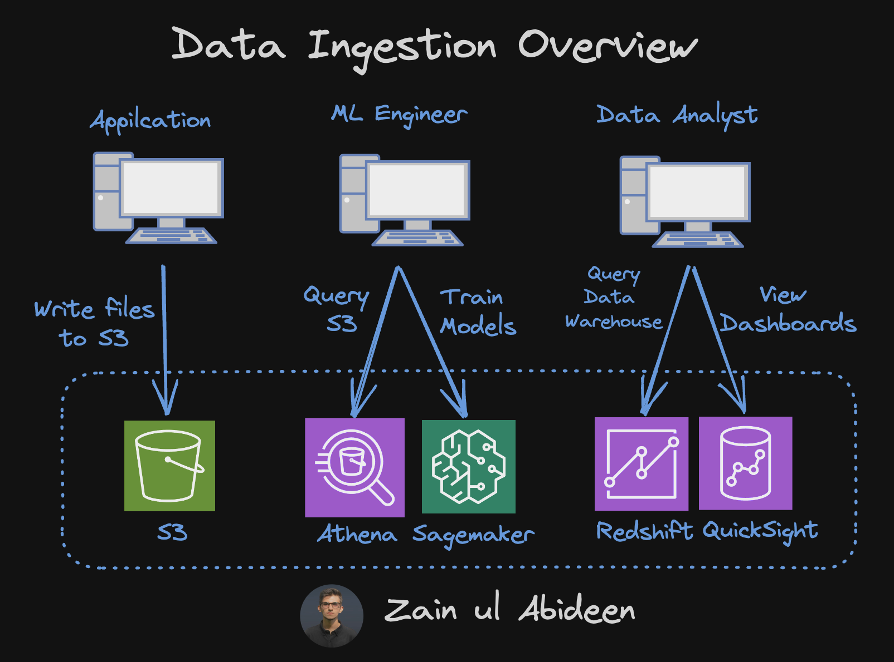
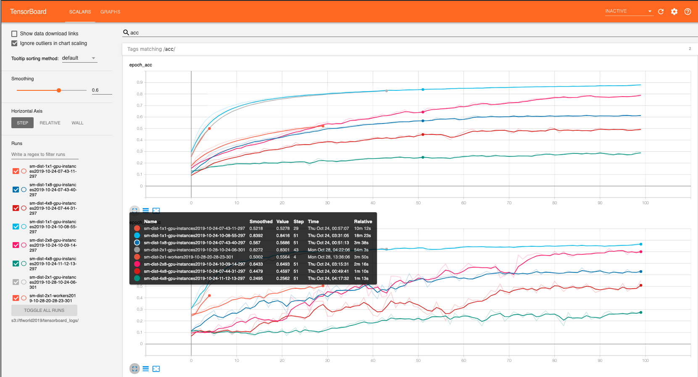
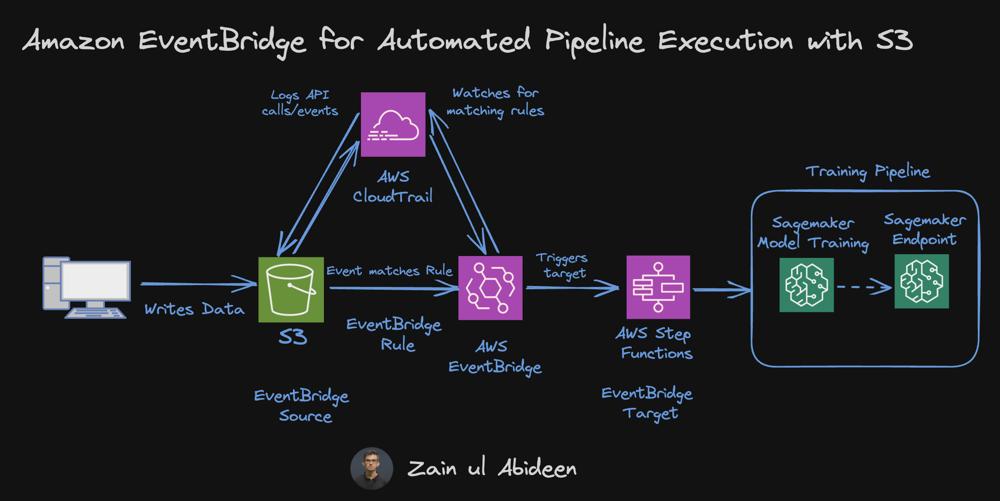
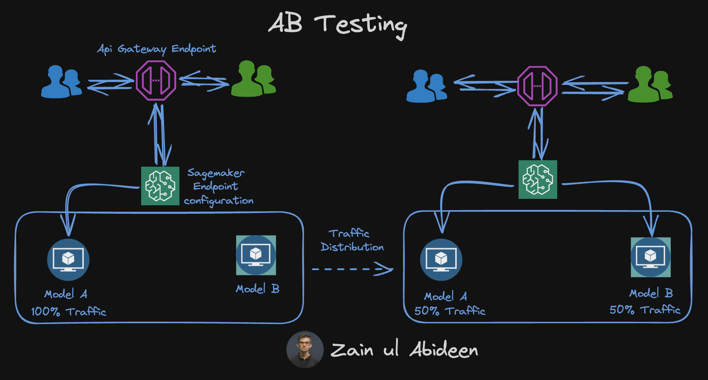
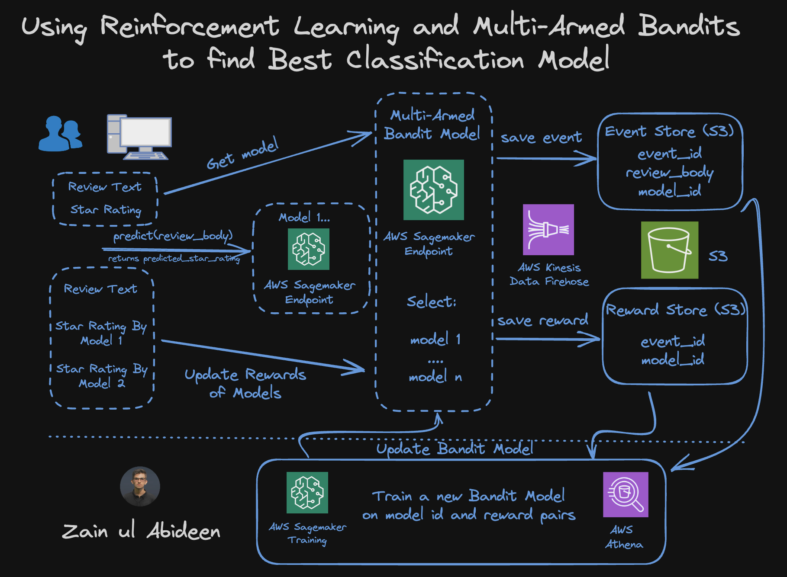
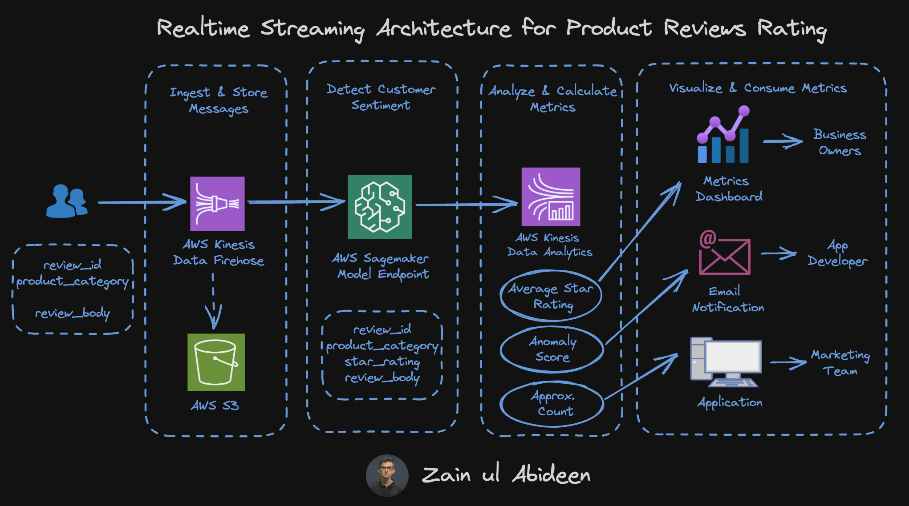

## End to End Real time :clock1: Machine Learning Pipeline to Predict Star Rating of Product Reviews :postbox:

This project is an End-to-End ML pipeline for natural language processing with Amazon **SageMaker**. The main objective of this project is to build an infrastructure for continuous analytics and automating the pipeline. This project involves training and tuning a text classifier to predict the star rating for product reviews using the SOTA **BERT** model for language representation. To build BERT-based NLP text classifier, I used a product reviews dataset where each record contains some review text and a star rating (1-5).  Advanced model training and deployment techniques such as hyper-parameter tuning, **A/B testing**, and **Bandit testing** are also performed. Lastly, a real-time, **streaming analytics** and data science pipeline to perform window-based aggregations and **anomaly detection** is set up. 
 <br/>

<p align="center">

</p>


## Table of Contents
  * [What are Telephone-based Social Engineering attacks?](#what-are-telephone-based-social-engineering-attacks)
  * [Data Ingestion and Analysis with AWS S3, Redshift, and Athena](#data-ingestion-and-analysis-with-aws-s3,-redshift,-and-athena)
  * [Exploring and visualizing the data with Athena and Matplotlib](#exploring-and-visualizing-the-data-with-athena-and-matplotlib)
  * [Building an Automated Data Pipeline with EventBridge and Step functions](#building-an-automated-data-pipeline-with-eventbridge-and-step-functions)
  * [Testing different models in live production with AB testing](#testing-different-models-in-live-production-with-ab-testing)
  * [Dynamically shifting the traffic to better performing BERT model with Multi-Armed Bandits](#dynamically-shifting-the-traffic-to-better-performing-bert-model-with-multi-armed-bandits)
  * [Continuous Analytics and ML over Streaming data with AWS Kinesis](#continuous-analytics-and-ml-over-streaming-data-with-aws-kinesis)
  * [Setup](#setup)
  * [Todos](#todos)
  * [Acknowledgements](#acknowledgements)
  * [Citation](#citation)
  * [Connect with me](#connect-with-me)

## What-are-Telephone-based-Social-Engineering-attacks

Telephone-based social engineering attacks, also known as phone scams, are a form of cyber attack where malicious actors use the phone as a medium to manipulate individuals or organizations into revealing sensitive information, performing actions, or providing financial gains. These attacks rely on the art of persuasion, psychological manipulation, and impersonation to deceive and exploit victims. 

Each scam type is identified by a set of speech acts that are collectively referred to as a **Scam Signature**. We can define a scam signature as a set of utterances that perform speech acts that are collectively unique to a class of social engineering attacks. These utterances are the key points, fulfilling the goal of the scammer
for that attack. A scam signature uniquely identifies a class of social engineering attacks in the same way that a malware signature uniquely identifies a class of malware. I will use a social engineering detection approach called the **Anti-Social Engineering Tool (ASsET)**, which detects attacks based on the semantic content of the conversation.


## Data Ingestion and Analysis with AWS S3, Redshift, and Athena

For data ingestion, I have used Amazon S3 as the central data lake where I store all raw data in TSV/Parquet format. This data needs to be accessed by both the data science / machine learning team, as well as the business intelligence / data analyst team.

**Data science or Machine learning** teams need access to all of the raw data, and be able to quickly explore it. They leverage **Amazon Athena** as an interactive query service to analyze data in Amazon S3 using standard SQL, without moving the data. 


**Business intelligence team and Data analysts** mostly want to have a subset of the data in a data warehouse which they can then transform, and query with their standard SQL clients to create reports and visualize trends. I have leveraged **Amazon Redshift**, a fully managed data warehouse service.

Explore data ingestion notebook `Ingest.ipynb` for more details.

<p align="center">

</p>


## Exploring and visualizing the data with Athena and Matplotlib

This section invloves exploring, visualizing and understanding part of the raw data with Athena and Matplotlib. I have covered these important questions regarding the problem statement and raw data:

1. Which Product Categories are Highest Rated by Average Rating?
2. Which Product Categories Have the Most Reviews?
3. When did each product category become available in the Data catalog based on the date of the first review?
4. What is the breakdown of ratings (1-5) per product category?  
5. How Many Reviews per Star Rating? (5, 4, 3, 2, 1) 
6. How Did Star Ratings Change Over Time?
7. Which Star Ratings (1-5) are Most Helpful?
8. Which Products have Most Helpful Reviews?  How Long are the Most Helpful Reviews?
9. What is the Ratio of Positive (5, 4) to Negative (3, 2 ,1) Reviews?
10. Which Customers are Abusing the Review System by Repeatedly Reviewing the Same Product?  What Was Their Average Star Rating for Each Product?


Explore data ingestion notebook `Analysis.ipynb` for more details.

## Building an Automated Data Pipeline with EventBridge and Step functions

### Tensorboard training visualization
<p align="center">

</p>

<p align="center">

</p>

Explore training and deployment pipeline notebook `TrainDeploy_Pipeline.ipynb` for more details.

## Testing different models in live production with A/B testing

A/B testing is a statistical approach for comparing two or more versions/features to evaluate not only which one works better but also if the difference is statistically significant. A/B testing can be used for a variety of purposes like: refining the messaging and design of marketing campaigns, increasing conversion rates by improving the user experience, consider user involvement while optimizing assets such as web pages, ads, etc.

This section involves A/B testing two different models which have been trained on different subsets of data. Model A has been trained on one month old data and Model B has been trained on most recent data. We have used traffic splitting to direct subsets of users to different model variants for the purpose of comparing and testing different models in live production. The goal is to see which variants perform better. Often, these tests need to run for a long period of time (weeks) to be statistically significant. The figure shows 2 different models deployed using a random 50-50 traffic split between the 2 variants.

<p align="center">

</p>

Explore AB testing notebook `AB-Test.ipynb` for more details.

## Dynamically shifting the traffic to better performing BERT model with Multi-Armed Bandits

Unlike traditional A/B tests, the bandit model will learn the best BERT model (action) for a given context over time and begin to shift traffic to the best model.  Depending on the aggressiveness of the bandit model algorithm selected, the bandit model will continuously explore the under-performing models, but start to favor and exploit the over-performing models.  And unlike A/B tests, multi-armed bandits allow you to add a new action (ie. BERT model) dynamically throughout the life of the experiment.  When the bandit model sees the new BERT model, it will start sending traffic and exploring the accuracy of the new BERT model - alongside the existing BERT models in the experiment.

 This implementation continuously updates a Vowpal Wabbit reinforcement learning model using Amazon SageMaker, DynamoDB, Kinesis, and S3.

The client application, a recommender system with a review service in our case, pings the SageMaker hosting endpoint that is serving the bandit model.  The application sends the an `event` with the `context` (ie. user, product, and review text) to the bandit model and receives a recommended action from the bandit model.  In our case, the action is 1 of 2 BERT models that we are testing.  The bandit model stores this event data (given context and recommended action) in S3 using Amazon Kinesis. 

The client application uses the recommended BERT model to classify the review text as star rating 1 through 5 and  compares the predicted star rating to the user-selected star rating.  If the BERT model correctly predicts the star rating of the review text (ie. matches the user-selected star rating), then the bandit model is rewarded with `reward=1`.  If the BERT model incorrectly classifies the star rating of the review text, the bandit model is not rewarded (`reward=0`).

The client application stores the rewards data in S3 using Amazon Kinesis.  Periodically (ie. every 100 rewards), we incrementally train an updated bandit model with the latest the reward and event data.  This updated bandit model is evaluated against the current model using a holdout dataset of rewards and events.  If the bandit model accuracy is above a given threshold relative to the existing model, it is automatically deployed in a blue/green manner with no downtime.  SageMaker RL supports offline evaluation by performing counterfactual analysis (CFA).  By default, we apply [**doubly robust (DR) estimation**](https://arxiv.org/pdf/1103.4601.pdf) method. The bandit model tries to minimize the cost (`1 - reward`), so a smaller evaluation score indicates better bandit model performance.


<p align="center">

</p>

Explore multi armed bandit notebook `Bandit-Test.ipynb` for more details.

## Continuous Analytics and ML over Streaming data with AWS Kinesis

<p align="center">

</p>

<p align="center">

</p>


Explore streaming analytics notebook `StreamingAnalytics.ipynb` for more details.


## Setup

So we talked about what telephone based social engineering attacks are, and what they can do for you (among other things). <br/>
Let's get this thing running! Follow the next steps:

1. Create an AWS account and launch Sagemaker studio.
2. Configure IAM to run the notebooks. Attach `AdministratorAccess` policy.
3. Launch a terminal in your Sagemaker Jupyter instance.
4. `git clone https://github.com/abideenml/RealTime-StarRatingPrediction-with-AWSKinesis`
5. Navigate into project directory `cd path_to_repo`
6. Create a new venv environment and run `pip install -r requirements.txt`. 
7. Run the `Ingest.ipynb`, `Analysis.ipynb`, `TrainDeploy_Pipeline.ipynb`, `StreamingAnalytics.ipynb`, `AB-Test`, and `Bandit-Test` files in order for ingestion, exploration, model training, realtime model prediction, AB testing and bandit testing.

That's it! <br/>


## Todos:

Finally there are a couple more todos which I'll hopefully add really soon:
* Test Data quality with Deequ and also add workflow to capture data drift.
* Make AWS QuickSight Dashboard to view KPIs and others metrics.
* Use Kubeflow for managing machine learning workflows.


## Acknowledgements

I found these resources useful (while developing this one):

* [BERT Paper](https://arxiv.org/abs/1810.04805)
* [AWS Sagemaker](https://towardsdatascience.com/aws-sagemaker-db5451e02a79)
* [Multi-Armed Bandit](https://www.youtube.com/watch?v=e3L4VocZnnQ&ab_channel=ritvikmath)
* [AWS Kinesis](https://www.youtube.com/watch?v=_t3k6oX2mfc&t=361s&ab_channel=JohnnyChivers)
* [AWS Serverless](https://faun.pub/aws-lambda-serverless-framework-python-part-1-a-step-by-step-hello-world-4182202aba4a)
* [Working with Contextual Bandits](https://vowpalwabbit.org/docs/vowpal_wabbit/python/latest/tutorials/python_Contextual_bandits_and_Vowpal_Wabbit.html)


## Citation

If you find this code useful, please cite the following:

```
@misc{Zain2023Realtime-ratingprediction-productreviews,
  author = {Zain, Abideen},
  title = {realtime-ratingprediction-productreviews},
  year = {2023},
  publisher = {GitHub},
  journal = {GitHub repository},
  howpublished = {\url{https://github.com/abideenml/RealTime-StarRatingPrediction-with-AWSKinesis}},
}
```

## Connect with me

If you'd love to have some more AI-related content in your life :nerd_face:, consider:

* Connect and reach me on [LinkedIn](https://www.linkedin.com/in/zaiinulabideen/) and [Twitter](https://twitter.com/zaynismm)
* Follow me on 📚 [Medium](https://medium.com/@zaiinn440)
* Subscribe to my 📢 weekly [AI newsletter](https://rethinkai.substack.com/)!

## Licence

[](https://github.com/abideenml/RealTime-StarRatingPrediction-with-AWSKinesis/blob/master/LICENCE)